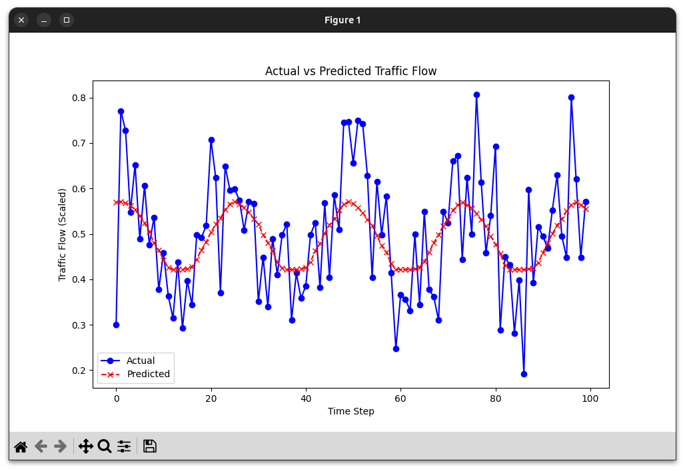

# 🚦 Traffic Flow Prediction Using Neural Networks 🧠🚗  
*Lab 5 Report by: **Donfack Tsopfack Yves Dylane***  
**Instructor**: Mbachan Fabrice  
📍 *City Focus: Yaoundé, Cameroon*  

---

## 🌟 **Introduction**  
Traffic congestion is one of the most pressing issues in modern cities 🌍, and Yaoundé is no exception. With increasing vehicle density 🚘 and complex traffic patterns, managing traffic efficiently is a high priority. This project leverages the power of **Neural Networks** 🧠 to predict traffic flow and congestion patterns, showcasing how AI can drive smart city solutions 🚀.  

In this lab, we explored:  
- 🌦️ How weather and time-related factors impact traffic.  
- 📊 Techniques for handling sequential data.  
- 🛠️ Building and training neural networks for prediction.  

This project isn't just about data—it's about creating smarter cities for better urban mobility 🏙️.  

---

## 🎯 **Objective**  
- 📈 Predict traffic congestion levels using historical data, weather conditions, and time-related features.  
- 🧠 Build and train neural networks for forecasting.  
- 🔍 Explore spatial and temporal traffic trends for smarter city solutions.  

---

## 🧑‍💻 **Skills Developed**  
- 📅 Handling time-series (sequential) data.  
- 🛠️ Building predictive models using TensorFlow/Keras.  
- 🔄 Identifying patterns in traffic influenced by environmental factors.  

---

## ⚙️ **Tools & Technologies**  
- **Python Libraries**:  
  - 📊 `NumPy` & `Pandas`: Data manipulation experts!  
  - 🧠 `Keras` & `TensorFlow`: The brains of our neural network.  
  - 🎨 `Matplotlib` & `Seaborn`: Data visualization champions.  
  - 🛠️ `Scikit-learn`: Helper for preprocessing and performance metrics.  
- **Dataset**: Historical traffic, weather 🌦️, and time ⏰ data (or simulated if unavailable).  

---

## 🚀 **Project Workflow**  
### 🔢 **1. Data Preprocessing**  
- ✅ Loaded data and cleaned missing entries.  
- 📅 Extracted time-based features: **hour, day, weekend labels**.  
- ⚖️ Normalized weather data (e.g., temperature, humidity).  

### 🎨 **2. Feature Engineering**  
- 🕒 Added lag features (e.g., traffic from previous hours).  
- 🛠️ Prepared data for model input with MinMaxScaler.  

### ✂️ **3. Data Splitting**  
- 📂 Split data into **80% training**, **20% testing**, with optional validation set.  
- ⚖️ Ensured all data was consistently scaled for better performance.  

### 🏗️ **4. Model Building**  
- Designed a **Sequential Neural Network** with:  
  - 🔄 **LSTM Layers** for sequence learning.  
  - 🚪 **Dropout Layers** to prevent overfitting.  
  - 📊 **Dense Layers** for refined predictions.  
- Loss Function: **Mean Squared Error (MSE)**.  
- Optimizer: **Adam** 🛠️.  

### 🧪 **5. Model Training & Evaluation**  
- 🏋️‍♂️ Trained the model for 50 epochs with early stopping and learning rate reduction.  
- 📊 Evaluated with metrics:  
  - 🛠️ **MSE, MAE** for error analysis.  
  - 🔍 **MAPE** for percentage accuracy.  

---

## 📊 **Results**



**Metrics Achieved**:  
- 🟢 **Validation Loss (MSE)**: *0.0108*.  
- 🟢 **Validation MAE**: *0.0809*.  
- 🟢 **Validation MAPE**: *24.4%*.  

💡 **Insights**:  
- Time features like **rush hour** and **weekends** heavily influence traffic flow.  
- Environmental conditions like rain 🌧️ and temperature 🌡️ also play a significant role.  

---

## 🔮 **Future Scope**  
- 🛣️ Expand the model to include **real-time traffic data**.  
- 🌐 Integrate with APIs for live weather updates.  
- 🧠 Enhance prediction accuracy with more advanced architectures (e.g., Transformer models).  

---

## 👨‍💻 **How to Run**  
1. 📥 Clone the repo:  
   ```bash  
   git clone https://github.com/yvesdylane/Traffic_Flow_Prediction_Using_Neural_Networks
   ```

2. 📂 Navigate to the directory:
   ```bash
   cd Traffic_Flow_Prediction_Using_Neural_Networks
   ```

3. ⚙️ Install dependencies:
   ```bash
   pip install -r requirements.txt  
   ```

4. 🏃‍♂️ Run the Complete Main file ✨.


## 🤝 Contributions
Got ideas? Found a bug 🐛? Submit an issue or create a pull request!


## 📄 License
This project is licensed under the MIT License.


## 🎉 Thank you for visiting! Don't forget to ⭐ this repo if you find it helpful!
